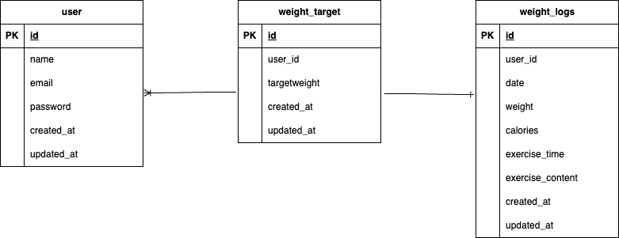

# Pigly

体重記録と目標管理ができるヘルスケアアプリケーションです。ユーザーは体重を記録し、目標体重の達成を目指します。

---

## 環境構築

Docker を使用して開発環境を構築しています。
docker-compose.ymlのnginx,mysqlにplatform: linux/amd64と記述しています。必要に応じて変更してください。

### 起動手順

#### ビルド＆起動
```bash
docker compose up -d --build
```

#### Laravelコンテナに入る
```bash
docker compose exec app bash
```

####Composerインストールの確認
```bash
composer -v
```

#### .envファイルのコピーと環境変数の追加
```bssh
* cp .env.example .env
* DB_CONNECTION=mysql
* DB_HOST=mysql
* DB_PORT=3306
* DB_DATABASE=laravel_db
* DB_USERNAME=laravel_user
* DB_PASSWORD=laravel_pass
```

####アプリケーションキーの作成
```bash
php artisan key:generate
```

##### マイグレーション・シーディング実行
```bash
php artisan migrate:fresh --seed
```
---

##### 使用技術
PHP7.4.9 /
Laravel8.83.29 /
MySQL8.0.26 /
Laravvel Fortify
---

### 📊 ER図



##URL
開発環境：http://localhost
